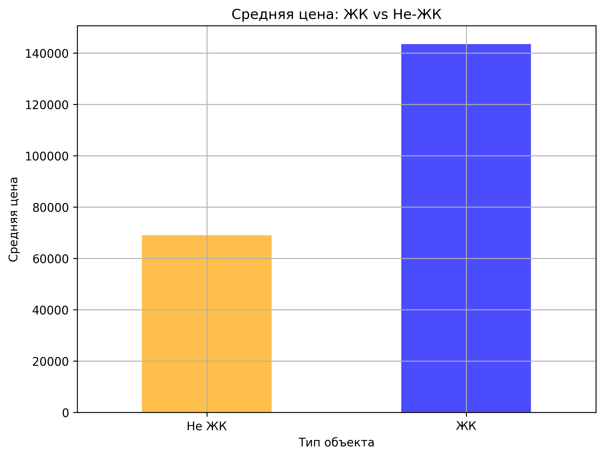
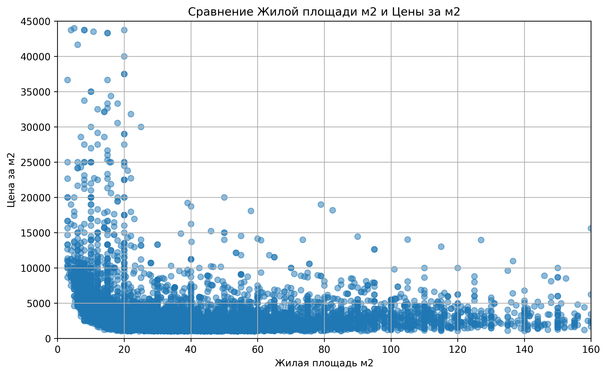

# EDA

## Описание задачи: сделать обработку и анализ полученных данных и построить графики, отображающие основные показатели и зависимости, сделать выводы.

## Состав группы: Тарасов Андрей, Колганов Роман.

### Была проведена работа по:
- Фильтрации данных по городу Москва (удалены все строки, кроме тех, в которых в колонке 'Адрес' указано "Москва");
- Преобразованию данных в колонке 'Количество комнат';
- Форматированию данных в колонке 'Цена';
- Заполнению данных в колонках на основе ключевых слов из других колонок;
- Разделению колонки 'Площадь, м2' на 'Общая площадь', 'Жилая площадь', и 'Площадь кухни' и логическое заполнение последних;
- Заполнению пропусков в колонках, в том числе медианными значениями с использованием логических операций;
- Замене всех названий колонок, которые были на русском, на их английские эквиваленты;
- Сохранению результатов работы DataFrame в CSV файл;
- Устранению пропущенных значений в каждой колонке;
- Приведению всех значений внутри данных к численному типу (int или float);
- Устранению дубликатов объявлений;
- Построению графиков, представляющие основную информацию по базе данных (количество строк и столбцов в таблице, количество пропусков по колонкам, cоотношение количества пропусков к заполненным ячейкам);
- Построению графиков, иллюстрирующие основные зависимости (стоимости аренды от жилой площади, средней стоимости квартиры по количеству комнат, стоимости аренды от типа ЖК).

# Анализ данных о недвижимости

## Графики

### Средняя цена: ЖК vs Не-ЖК

### Сравнение Жилой площади м2 и Цены за м2

## Выводы

- Цена за квадратный метр имеет тенденцию снижаться с увеличением жилой площади. На маленьких квартирах (до 20 м²) цена за квадратный метр намного выше, чем на более просторных квартирах.
- Диапазон цен для небольших квартир (менее 20 м²) варьируется значительно, достигая до 45,000 рублей за квадратный метр. Однако для более крупных квартир (свыше 50 м²) цены за квадратный метр становятся более стабильными и находятся в пределах 5,000 - 10,000 рублей.
- Выбросы присутствуют в виде высоких значений на маленьких площадях, что может быть связано с более дорогими объектами, расположенными в престижных районах или новыми постройками.

## Основные выводы:

- Средняя цена объектов, находящихся в ЖК, превышает 140,000, что почти в два раза больше, чем средняя цена объектов не в ЖК, которая составляет около 70,000.
- Этот результат может говорить о том, что объекты в жилых комплексах (ЖК) считаются более престижными и дорогими. Возможно, они предоставляют лучшие условия или находятся в более привлекательных районах.
